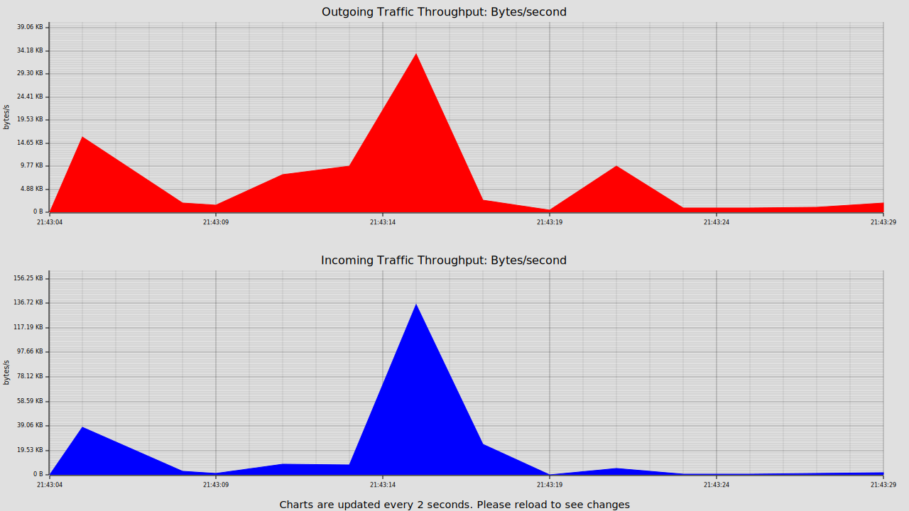
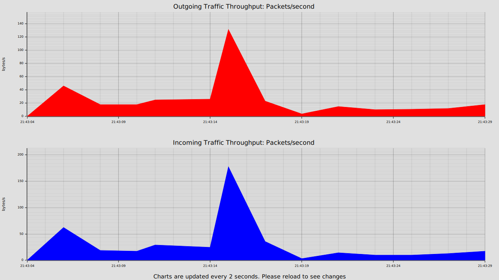

# Sniph - Packet monitoring, filtering and analysis made simple and intuitive

[](https://opensource.org/licenses/Apache-2.0)
[](https://www.rust-lang.org/)

<p align="center">
    
</p>

## Think tcpdump, but for humans 😄

## ✨ Features

### Cross Platform and multi-threaded
Sniph works on Linux, MacOS and Windows.

### Beautiful and Intuitive output
See packets in an easy to understand format. (subject to terminal width)
```bash
./sniph -i en0
+-----------------------------------------------------------------------------------------------------------------------------------------------------------------------------------------+
|                   Source IP                   |                Destination IP                 | Src Port  | Dest Port |   IP   |  Direction  | Layer 4  | Layer 7 |      timestamp      |
+-----------------------------------------------------------------------------------------------------------------------------------------------------------------------------------------+
|    2a00:23c7:47c6:b501:31cf:ad92:2b8a:b322    |             2606:4700::6810:a76b              |   54495   |    443    |  IPV6  |  OUTGOING   |   TCP    |  HTTPS  | 2025-09-26 14:13:33 |
+-----------------------------------------------------------------------------------------------------------------------------------------------------------------------------------------+
|                 192.168.1.95                  |                239.255.255.251                |   48948   |   1900    |  IPV4  |  OUTGOING   |   UDP    |  SSDP   | 2025-09-26 14:13:38 |
+-----------------------------------------------------------------------------------------------------------------------------------------------------------------------------------------+
|                 192.168.1.254                 |                239.255.255.251                |   39927   |   1900    |  IPV4  |  MULTICAST  |   UDP    |  SSDP   | 2025-09-26 14:13:38 |
+-----------------------------------------------------------------------------------------------------------------------------------------------------------------------------------------+
```

### Simple and Robust Packet filtering
Filter packets by combinations of `src_ip`, `dst_ip` ,`src_port`, `dst_port` and `transport`. Example.

```bash
./sniph -i en0 -f "src_ip == 2a01:23c6:47a6:b501:19d2:6381:6249:91df, src_port > 22"
+-----------------------------------------------------------------------------------------------------------------------------------------------------------------------------------------+
|                   Source IP                   |                Destination IP                 | Src Port  | Dest Port |   IP   |  Direction  | Layer 4  | Layer 7 |      timestamp      |
+-----------------------------------------------------------------------------------------------------------------------------------------------------------------------------------------+
|    2a01:23c6:47a6:b501:19d2:6381:6249:91df    |           2a00:1450:4009:820::200a            |   53478   |    443    |  IPV6  |  OUTGOING   |   UDP    |  HTTPS  | 2025-09-26 21:40:19 |
+-----------------------------------------------------------------------------------------------------------------------------------------------------------------------------------------+
|    2a01:23c6:47a6:b501:19d2:6381:6249:91df    |            2a00:1450:4009:c15::5f             |   56944   |    443    |  IPV6  |  OUTGOING   |   UDP    |  HTTPS  | 2025-09-26 21:40:19 |
+-----------------------------------------------------------------------------------------------------------------------------------------------------------------------------------------+
|    2a01:23c6:47a6:b501:19d2:6381:6249:91df    |           2a00:1450:4009:820::200a            |   53478   |    443    |  IPV6  |  OUTGOING   |   UDP    |  HTTPS  | 2025-09-26 21:40:19 |
+-----------------------------------------------------------------------------------------------------------------------------------------------------------------------------------------+
```

### Packet Aggregation and throughput Graphs
Generate a csv report of aggregated packets, as well as SVG images of data and packet throughput.

#### Example CSV:

|src_ip                                 |dest_ip                                |src_port|dest_port|ip_version|transport_protocol|traffic_direction|num_packets|bytes_transferred|start_time         |end_time           |time_window_start  |
|---------------------------------------|---------------------------------------|--------|---------|----------|------------------|-----------------|-----------|-----------------|-------------------|-------------------|-------------------|
|2a00:1450:4009:c08::13                 |2a01:23c6:47a6:b501:19d2:6381:6249:91df|443     |59437    |IPV6      |TCP               |INCOMING         |16         |5415             |2025-09-26 21:43:04|2025-09-26 21:43:05|2025-09-26 21:43:04|
|2a01:23c6:47a6:b501:19d2:6381:6249:91df|2a00:1450:4009:c0b::5f                 |49437   |443      |IPV6      |UDP               |OUTGOING         |15         |1368             |2025-09-26 21:43:04|2025-09-26 21:43:27|2025-09-26 21:43:04|
|2a01:23c6:47a6:b501:19d2:6381:6249:91df|2a00:1450:4009:c08::13                 |59437   |443      |IPV6      |TCP               |OUTGOING         |15         |6794             |2025-09-26 21:43:04|2025-09-26 21:43:05|2025-09-26 21:43:04|

#### Throughput Files

<p align="center">
    
</p>

<p align="center">
    
</p>


### Pause and Resume Capturing

*Press `p` to pause capturing packets and `r` to resume capturing packets*

#### and many more .............


## Installation

### Prerequisites

#### Rust

Make sure you have Rust (1.86+) and Cargo installed. You can install them using [here](https://rust-lang.org/tools/install/).


#### OS Specific Dependencies
See installation instructions for your in the [installation guide](INSTALL.md). 

#### Installation via Cargo
```bash
cargo install sniph
```

#### Build from source
```bash
git clone https://github.com/samuelorji/sniph.git
cd sniph
cargo build --release
./target/release/sniph -i <network interface>
```


## 🚀 Quick Start
> On Windows, the following commands will be `sniph.exe` instead of `sniph`
### List available network interfaces
```bash
sniph -d
```

### Start sniffing on a specific interface
```bash
sniph -i en0
```
### Start sniffing on a specific interface and write report to output folder
```bash
sniph -i en0 -o ./output
```

### Start sniffing on a specific interface with a filter and write report to output folder
```bash
sniph -i en0 -f "src_ip == 2a01:23c6:47a6:b501:19d2:6381:6249:91df, src_port > 22" -o ./output
``` 

### Start sniffing on a specific interface with a filter, aggregation window of 60 seconds and write report to output folder
```bash
sniph -i en0 -f "src_ip == 2a01:23c6:47a6:b501:19d2:6381:6249:91df, src_port > 22" -w 60 -o ./output
```
### Stop sniffing
*Press `Ctrl + C` to stop sniffing. Sniph will gracefully shutdown and write some stats to console and write report to output folder if specified*


## CLI Options.
```bash
Simple and intuitive Packet Sniffing Program

Usage: sniph [OPTIONS]

Options:
  -d, --devices
          Prints devices or interfaces found on system and exits
  -i, --interface <INTERFACE>
          interface to sniff on. Will exit with an error if the interface cannot be found
  -o, --output <OUTPUT>
          Optional output folder where report will be written to. If no output is specified, no report is written output will be a folder with name report_YYYY_MM_DD_H_M_S containing a report in csv and 2 SVG files showing data and packet throughput
  -b, --buffer <BUFFER>
          size of print buffer, if set to 0, packets will be printed to stdout immediately.
          if set to a larger number, calls to stdout will be buffered up to this value and then written to stdout. [default: 1024]
  -q, --quiet
          If captured packets should be printed to stdout in realtime, quiet mode can result in better performance as there won't be calls to print to console
  -f, --filter <FILTER>
          Filters to apply to captured packets E.g src_port > 8000 or dst_port < 4000
          Multiple filters can be combined by commas (e.g src_ip > 8000, dst_ip < 4000)
          Each filter should be in the format <field> <operator> <value>
          Supported fields: src_ip, dst_ip, src_port, dst_port, transport
          Supported operators: >, <, >=, <=, ==, !=
          Example: --filter "src_ip == 192.168.1.1"
          Example: --filter "src_port >= 8000, dst_port < 4000"
          Note: A space must exist between the field, operator and value
          Note: No spaces between commas and next filter
          If no filter is provided, all packets are captured
          == and != operators are string comparisons and only valid for IP addresses and protocol
          >, <, >=, <= operators are numeric comparisons and only valid for ports
  -w, --window <WINDOW>
          time window to group packet statistics together before writing to output file
          Not supplying a window means that statistics will be aggregated in memory for the entire length of the program running which can lead to increased memory consumption
      --max-packet-size <MAX_PACKET_SIZE>
          Optional packet size limit for captured packets
          Setting to a lower value can result in better performance as less data is copied from kernel space to user space
          However, setting to a lower value means that some packets may be truncated and therefore dropped by the packet parser
          Default is 5000 bytes which should be sufficient for most use cases [default: 5000]
  -h, --help
          Print help
  -V, --version
          Print version
```


## Packet Filtering


### 🔍 Packet Filtering Engine
- **Multi-field Filtering**: Filter by source/destination IP addresses and ports
- **Transport Protocol Filtering**: Support for TCP and UDP protocol filtering
- **Flexible Operators**: Equality (`==`), inequality (`!=`), and range-based filtering (`>`, `<`, `>=`, `<=`)
- **Boolean Logic**: Support for inclusion and exclusion rules
- **IPv4/IPv6 Support**: String-based IP address matching (no validation performed)

## 🎯 Filter Syntax

### Supported Fields
- `src_ip` - Source IP address (canonical IPV4/IPV6 string comparison)
- `dst_ip` - Destination IP address (canonical IPV4/IPV6 stringcomparison)
- `src_port` - Source port number (1-65535)
- `dst_port` - Destination port number (1-65535)
- `transport` - Transport protocol (`tcp` or `udp`, case-insensitive)

### Supported Operators
- `==` - Exact match (for IPs and protocols)
- `!=` - Exclusion match (for IPs and protocols)
- `>=`, `<=` - Range comparisons (for ports only)
- `>`, `<` - Strict range comparisons (for ports only)

### Filter Syntax Rules
- Multiple filters are separated by commas
- Each filter has exactly 3 parts: `field operator value`
- Whitespace around operators is ignored
- Maximum of 10 filters per filter string
- Maximum value length of 49 characters
- Case-insensitive protocol matching
- Last filter for a field takes precedence (e.g multiple `src_port` filters)
- If no filters are specified, all packets are captured

### Example Filters
- `src_ip == 192.168.1.1`
- `dst_port >= 80, dst_port <= 443`
- `transport == tcp`
- `src_ip != 192.168.1.1`
- `src_port > 1024, dst_port < 8080, transport == udp`
- `src_ip == 2001:db8::1, dst_ip != 2001:db8::2, transport == tcp`


## Reports

### Text Report
Sniph generates a report in csv format containing aggregated packet statistics over a specified time window (default is none) if an output folder is specified. The aggregation window can be configured using the `-w` or `--window` argument.


The report contains the following fields:
- `src_ip`: Source IP address
- `dst_ip`: Destination IP address
- `src_port`: Source port number
- `dst_port`: Destination port number
- `ip_version`: IP version (IPv4 or IPv6)
- `transport_protocol`: Transport protocol (TCP or UDP)
- `traffic_direction`: Traffic direction (INCOMING, OUTGOING, MULTICAST)
- `num_packets`: Number of packets in the time window
- `bytes_transferred`: Total bytes transferred in the time window
- `start_time`: Start time of packet transmission
- `end_time`: End time of packet transmission
- `time_window_start`: Start time of the aggregation window


### Graphical Reports
Sniph generates two SVG graphs showing data and packet throughput over time if an output folder is specified
- `data_throughput.svg`: Graph showing data throughput (bytes per second) over time

See Example:
<p align="center">
    
</p>

- `packet_throughput.svg`: Graph showing packet throughput (packets per second) over time
See Example:
<p align="center">
    
</p>


## ⚖️ Behavior Details

### Port Range Defaults
- Default port range: 1-65535 for both source and destination
- Port filters are cumulative (last filter wins for conflicting ranges)
- Range validation ensures `min_port <= max_port`

### IP Address Matching
- String-based comparison (no IP parsing/validation)
- Exact string match required
- Case-sensitive comparison
- Supports canonical IP string format (IPv4 and IPv6 only)

### Protocol Matching
- Case-insensitive string comparison
- Only "tcp" and "udp" are supported
- Last protocol filter wins if multiple specified

### Filter Precedence
- Multiple filters for the same field: last filter wins
- Combined filters: all conditions must be satisfied
- No filters specified: default to permissive behavior

### Print to Console Behavior
- Packets are printed to console in a tabular format by default, but if you only want to write a report to an output folder and don't care about seeing packets in real-time, you can use the `-q` or `--quiet` flag to disable printing to console
- Buffered printing controlled by (`-b` or `--buffer`)  controls how many bytes are buffered before flushing to stdout
- Buffer size of 0 means immediate printing (no buffering)
- Larger buffer sizes reduce the number of write calls to stdout, improving performance
- Default buffer size is 1024 bytes


## 📄 License

Licensed under the Apache License, Version 2.0. See [LICENSE](APACHE-LICENSE).

Licensed under the MIT License, See [LICENSE](MIT-LICENSE)


### Contributing

We welcome contributions to Sniph! Please see the [contributing guide](CONTRIBUTING.md) file for more information on how to get involved.
